# 短剧题材研究｜层级地图

> 状态：v0.1  
> 目的：建立“市场题材标签 → Premise Architecture（故事前提架构）→ 具体机制 → Audience-side Value（观众侧价值）→ Plot / Story Dynamics（剧情 / 故事动力）”的层级关系。  
> 说明：本图用于研究导航，不代表最终科学分类；后续随着证据积累继续修订。  
> SVG 规范：英文专业名词首次出现时必须附带中文释义。

---

## ◆ 总览

```text
短剧题材研究
│
├─ Layer 0（第0层）｜Market Genre Labels（市场题材标签）
│  ├─ 重生
│  ├─ 系统
│  ├─ 穿越
│  ├─ 神豪
│  ├─ 战神
│  ├─ 甜宠
│  ├─ 霸总
│  ├─ 复仇
│  └─ 末世
│
├─ Layer 1（第1层）｜Premise Architecture（故事前提架构）
│  ├─ Advantage Architecture（优势架构）
│  ├─ Constraint / Disadvantage Architecture（约束 / 劣势架构）
│  ├─ Trade-off Architecture（交换 / 代价架构）
│  ├─ Transformation Architecture（状态转换架构）
│  ├─ World-Rule Architecture（世界规则架构）
│  ├─ Epistemic Architecture（信息 / 认知架构）
│  ├─ Problem / Threat Architecture（问题 / 威胁架构）
│  └─ Relationship Architecture（关系架构）
│
├─ Layer 2（第2层）｜Advantage Architecture（优势架构）
│  ├─ Advantage Source（优势来源）
│  ├─ Advantage Legitimation（优势合理化）
│  ├─ Advantage Type（优势类型）
│  │  ├─ Information Advantage（信息优势）
│  │  ├─ Experience Advantage（经验优势）
│  │  ├─ Skill Advantage（能力优势）
│  │  ├─ Resource Advantage（资源优势）
│  │  ├─ Status Advantage（地位优势）
│  │  └─ Power Advantage（权力优势）
│  ├─ Relative Asymmetry（相对不对称）
│  ├─ Magnitude（优势强度）
│  ├─ Scope（优势范围）
│  ├─ Cost（代价）
│  ├─ Exclusivity（独占性）
│  └─ Stability（稳定性）
│
├─ Layer 3（第3层）｜Audience-side Value（观众侧价值，暂不展开）
│  ├─ Competence（胜任感）
│  ├─ Wishful Identification（愿望性认同）
│  ├─ Payoff Reward（收益奖励）
│  ├─ Counterfactual Satisfaction（反事实满足）
│  ├─ Possible Self（可能自我）
│  └─ Self-Projection（自我投射）
│
└─ Layer 4（第4层）｜Plot / Story Dynamics（剧情 / 故事动力，当前暂缓）
   ├─ Goal / Action（目标 / 行动）
   ├─ Plot Causality（剧情因果）
   ├─ Payoff Structure（收益结构）
   └─ Story Progression（故事推进）
```

---

## ◆ Premise Architecture（故事前提架构）的当前位置

Premise Architecture（故事前提架构）研究：

> 一个故事前提，究竟改变了“主角—世界关系”的哪一类基础条件？

当前 v0.1 并列机制：

◇ Advantage Architecture（优势架构）  
给主角制造相对环境的正向不对称。

◇ Constraint / Disadvantage Architecture（约束 / 劣势架构）  
削减主角条件，增加限制与负向不对称。

◇ Trade-off Architecture（交换 / 代价架构）  
获得一种能力、资源或条件，同时支付另一种代价。

◇ Transformation Architecture（状态转换架构）  
改变主角的存在状态、身份状态、身体状态或世界位置。

◇ World-Rule Architecture（世界规则架构）  
改变所有角色共同面对的世界规则、社会规则或超自然规则。

◇ Epistemic Architecture（信息 / 认知架构）  
改变“谁知道什么”的信息分布。

◇ Problem / Threat Architecture（问题 / 威胁架构）  
向原本稳定状态引入必须处理的异常、危险、倒计时或危机。

◇ Relationship Architecture（关系架构）  
重构人物之间的绑定、依赖、合作、冲突、亲密与身份关系。

---

## ◆ Advantage Architecture（优势架构）的位置

Advantage Architecture（优势架构）只是 Premise Architecture（故事前提架构）的一个子类。

当前工作定义：

> 故事如何让角色相对于环境、对手或普通人建立正向不对称，并说明这种不对称来自哪里、作用在哪些维度、具有什么边界。

当前只研究题材层变量：

◇ Advantage Source（优势来源）  
优势从哪里出现。

◇ Advantage Legitimation（优势合理化）  
为什么世界规则允许这个优势成立。

◇ Advantage Type（优势类型）  
优势究竟属于信息、经验、能力、资源、地位还是权力。

◇ Relative Asymmetry（相对不对称）  
它相对于谁构成优势。

◇ Magnitude（优势强度）  
优势有多大。

◇ Scope（优势范围）  
优势能覆盖哪些问题。

◇ Cost（代价）  
使用或持有优势是否需要支付代价。

◇ Exclusivity（独占性）  
只有主角拥有，还是多人拥有。

◇ Stability（稳定性）  
优势永久有效、阶段有效，还是条件性有效。

---

## ◆ 典型题材映射

### ◇ 重生

- Transformation Architecture（状态转换架构）
- Advantage Architecture（优势架构）
- Epistemic Architecture（信息 / 认知架构）
- 可能同时包含 Problem / Threat Architecture（问题 / 威胁架构）
- 可能同时包含 Relationship Architecture（关系架构）

重生在 Advantage Architecture（优势架构）中通常提供：

- Information Advantage（信息优势）
- Experience Advantage（经验优势）

---

### ◇ 系统

- Advantage Architecture（优势架构）
- World-Rule Architecture（世界规则架构）
- Trade-off Architecture（交换 / 代价架构，若任务与惩罚存在）

常见优势：

- Information Advantage（信息优势）
- Skill Advantage（能力优势）
- Resource Advantage（资源优势）

---

### ◇ 穿越

- Transformation Architecture（状态转换架构）
- 可能形成 Advantage Architecture（优势架构）
- 也可能形成 Constraint / Disadvantage Architecture（约束 / 劣势架构）
- 常改变 Epistemic Architecture（信息 / 认知架构）

---

### ◇ 神豪

- Advantage Architecture（优势架构）

常见优势：

- Resource Advantage（资源优势）
- Status Advantage（地位优势）
- Power Advantage（权力优势）

---

### ◇ 战神 / 隐藏大佬

- Advantage Architecture（优势架构）
- Epistemic Architecture（信息 / 认知架构，身份隐藏时）

常见优势：

- Skill Advantage（能力优势）
- Status Advantage（地位优势）
- Power Advantage（权力优势）

---

## ◆ 当前层级边界

当前研究主线：

```text
Market Genre Labels（市场题材标签）
↓
Premise Architecture（故事前提架构）
↓
Advantage Architecture（优势架构）等基础前提机制
```

当前暂缓：

```text
Advantage Conversion（优势转化）
↓
Goal / Action（目标 / 行动）
↓
Plot Causality（剧情因果）
↓
Story Progression（故事推进）
```

原因：

> 当前研究主题是“题材 / 前提”，不是“剧情动力”。

已有相关研究资料保留，等未来进入 Plot / Story Dynamics（剧情 / 故事动力）专题时再以剧情为主重新组织。

---

## ◆ Mermaid（美人鱼流程图）版本

```mermaid
flowchart TD
    A["短剧题材研究"]

    A --> B["Layer 0（第0层）<br/>Market Genre Labels（市场题材标签）"]
    A --> C["Layer 1（第1层）<br/>Premise Architecture（故事前提架构）"]
    A --> D["Layer 2（第2层）<br/>Advantage Architecture（优势架构）"]
    A --> E["Layer 3（第3层）<br/>Audience-side Value（观众侧价值）"]
    A --> F["Layer 4（第4层）<br/>Plot / Story Dynamics（剧情 / 故事动力）"]

    B --> B1["重生"]
    B --> B2["系统"]
    B --> B3["穿越"]
    B --> B4["神豪"]
    B --> B5["战神"]
    B --> B6["甜宠 / 霸总"]
    B --> B7["复仇 / 末世"]

    C --> C1["Advantage Architecture（优势架构）"]
    C --> C2["Constraint / Disadvantage Architecture（约束 / 劣势架构）"]
    C --> C3["Trade-off Architecture（交换 / 代价架构）"]
    C --> C4["Transformation Architecture（状态转换架构）"]
    C --> C5["World-Rule Architecture（世界规则架构）"]
    C --> C6["Epistemic Architecture（信息 / 认知架构）"]
    C --> C7["Problem / Threat Architecture（问题 / 威胁架构）"]
    C --> C8["Relationship Architecture（关系架构）"]

    D --> D1["Advantage Source（优势来源）"]
    D --> D2["Advantage Legitimation（优势合理化）"]
    D --> D3["Advantage Type（优势类型）"]
    D --> D4["Relative Asymmetry（相对不对称）"]
    D --> D5["Magnitude（优势强度）"]
    D --> D6["Scope（优势范围）"]
    D --> D7["Cost（代价）"]
    D --> D8["Exclusivity（独占性）"]
    D --> D9["Stability（稳定性）"]

    D3 --> D31["Information Advantage（信息优势）"]
    D3 --> D32["Experience Advantage（经验优势）"]
    D3 --> D33["Skill Advantage（能力优势）"]
    D3 --> D34["Resource Advantage（资源优势）"]
    D3 --> D35["Status Advantage（地位优势）"]
    D3 --> D36["Power Advantage（权力优势）"]

    E --> E1["Competence（胜任感）"]
    E --> E2["Wishful Identification（愿望性认同）"]
    E --> E3["Payoff Reward（收益奖励）"]
    E --> E4["Counterfactual Satisfaction（反事实满足）"]
    E --> E5["Possible Self（可能自我）"]
    E --> E6["Self-Projection（自我投射）"]

    F --> F1["Goal / Action（目标 / 行动）"]
    F --> F2["Plot Causality（剧情因果）"]
    F --> F3["Payoff Structure（收益结构）"]
    F --> F4["Story Progression（故事推进）"]
```


